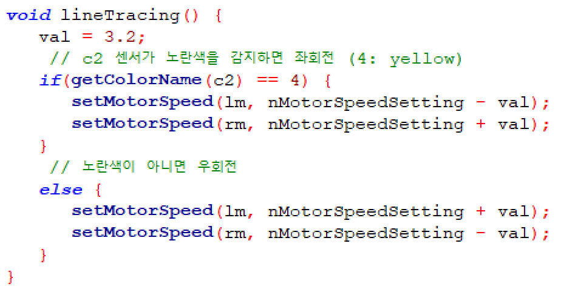
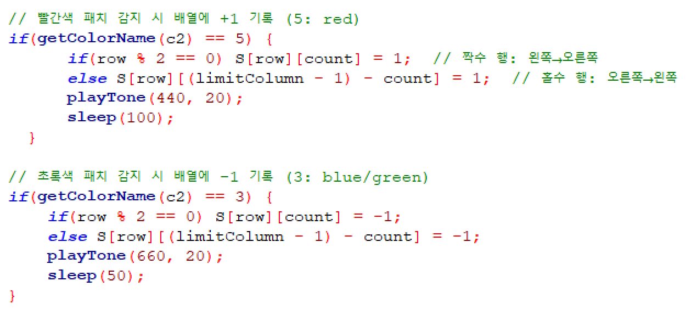
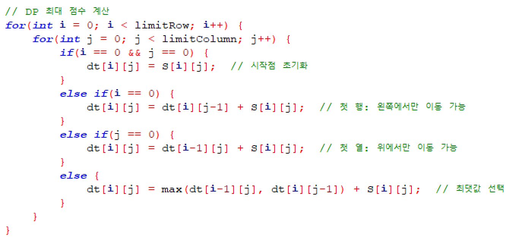
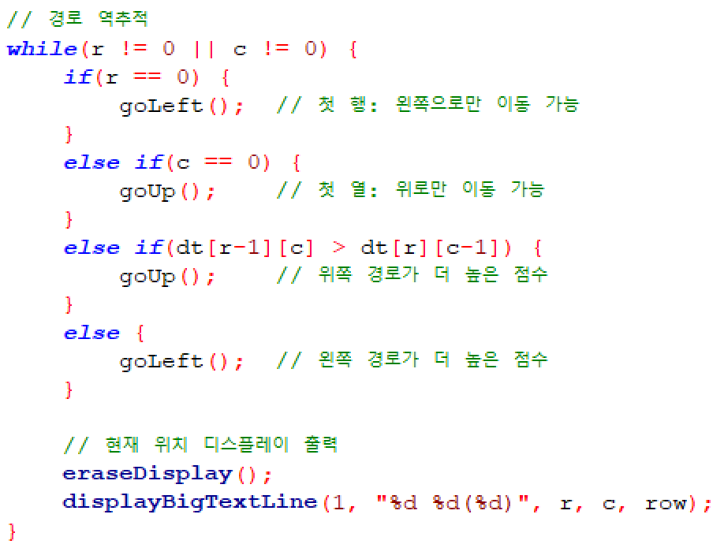
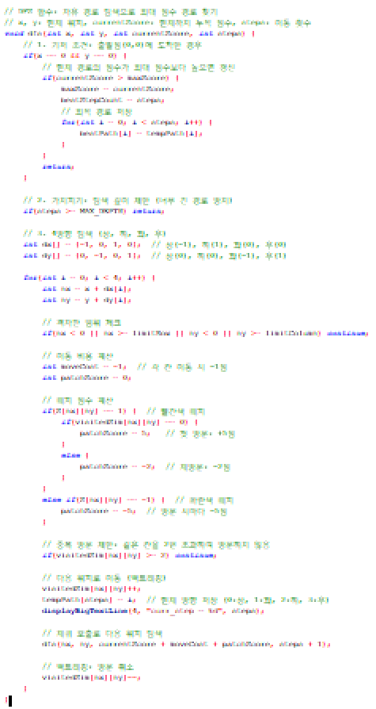
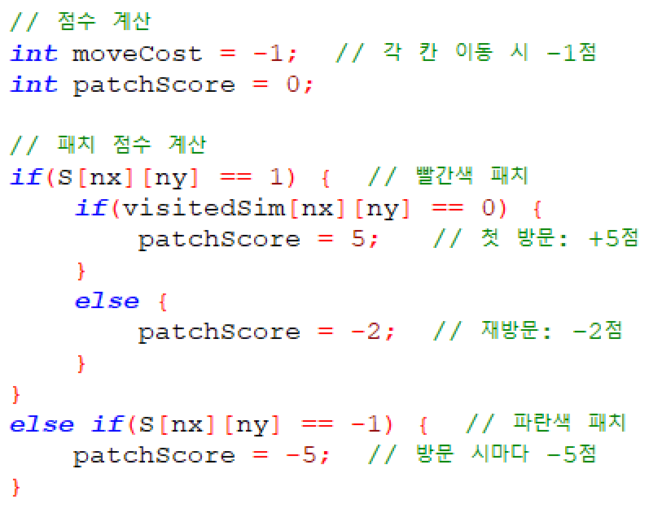
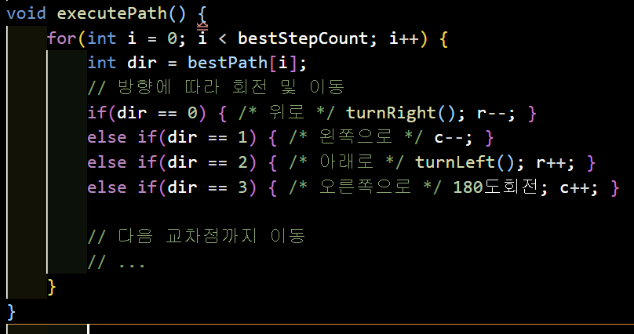
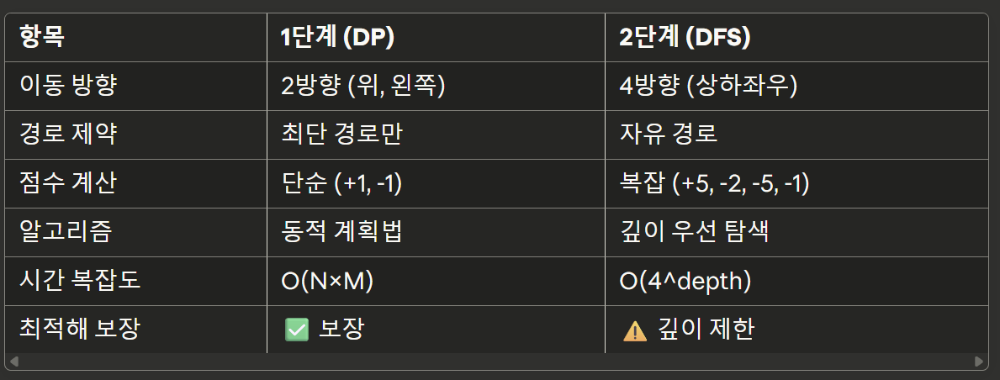

패치 획득 게임 프로젝트 발표 자료

슬라이드 1: 표지
제목: EV3 로봇 패치 획득 게임
과목: 스마트 센서와 액츄에이터
팀원: 박재형, 윤태웅, 이현빈, 전민석, 조민
날짜: 2025년 12월

---

슬라이드 2: 목차

프로젝트 개요
1단계 과제: 최단경로 패치 획득 게임
2단계 과제: 자유경로 패치 획득 게임
시연 영상
결과 및 성과
느낀점 및 개선사항

---

슬라이드 3: 프로젝트 개요
과제 목표

EV3 로봇을 활용한 격자판 탐색 및 패치 획득
알고리즘 기반 최적 경로 탐색
실시간 센서 제어 및 데이터 처리

사용 하드웨어

LEGO MINDSTORMS EV3
컬러 센서 3개 (S1, S2, S3)
대형 모터 2개 (motorB, motorC)

프로그래밍 환경

RobotC

---

슬라이드 4: 1단계 과제 - 문제 정의
과제 요구사항

격자판 크기: 4×4
탐색 방식: 행 우선 탐색
패치 종류:

빨간색 패치: +1점
파란색 패치: -1점

목표: 최단 경로로 최대 점수 획득

주요 단계

출발점(0,0) → 도착점(3,3) 완전 탐색
패치 위치 디스플레이 출력
이동점 → 출발점 최단 경로 복귀
획득 점수 출력

---

슬라이드 5: 1단계 - 알고리즘 설계
1) 행 우선 탐색 (Complete Search)

격자판을 좌→우, 우→좌 지그재그 방식으로 탐색
짝수 행: 왼쪽 → 오른쪽
홀수 행: 오른쪽 → 왼쪽
모든 격자점을 빠짐없이 방문

2) 동적 계획법 (DP)
dt[i][j] = 현재 위치까지의 최대 점수
dt[i][j] = max(dt[i-1][j], dt[i][j-1]) + S[i][j]

위 또는 왼쪽에서만 이동 가능
최적 부분 구조를 활용한 효율적인 경로 계산

3) 경로 역추적

DP 테이블을 역순으로 추적
더 높은 점수를 가진 경로 선택
출발점까지 최적 경로로 복귀

---

슬라이드 6: 1단계 - 핵심 코드 설명
라인 트레이싱

c2 센서로 노란색 라인 감지
PID 제어 방식으로 라인 추종

패치 감지 및 기록

---

슬라이드 7: 1단계 - 핵심 코드 설명 (계속)
DP 최대 점수 계산

경로 역추적

---

슬라이드 8: 1단계 - 시연 영상
[영상1: 1단계 로봇 작동 전체 과정]

영상 내용
행 우선 탐색으로 4×4 격자판 완전 탐색
패치 감지 및 기록 (빨강/파랑)
이동점 도착 후 격자판 디스플레이 출력
최단 경로로 출발점 복귀
최종 점수 출력

---

슬라이드 9: 1단계 - 결과
성과

행 우선 탐색 성공 (25점)
격자판 정보 정확 출력 (5점)
최단 경로 복귀 성공 (5점)
정확한 점수 출력 (5점)
획득 점수: [실제 점수]점 (순위: [등수])

격자판 출력 예시 (실제 이동 경로를 선으로 간단하게 표기해주면 좋을듯!)
+ O + +
+ X O +
+ + + X
+ O + +

+: 일반 격자점
O: 빨간색 패치 (+1점)
X: 파란색 패치 (-1점)

---

슬라이드 10: 2단계 과제 - 문제 정의
과제 요구사항

격자판 크기: 4×5
탐색 방식: 행 우선 탐색 + 자유 경로 이동
복잡한 점수 체계:

빨간색 패치: 첫 방문 +5점, 재방문 -2점
파란색 패치: 방문 시마다 -5점
각 엣지 이동: -1점

난이도 증가 요소

자유 경로: 상하좌우 모든 방향 이동 가능
방문 횟수: 같은 칸을 여러 번 방문 가능
복잡한 점수 계산: 이동 비용 + 패치 점수 + 재방문 페널티

---

슬라이드 11: 2단계 - 알고리즘 설계
깊이 우선 탐색 (DFS) + 백트래킹

목표: 이동점(3,4) → 출발점(0,0) 최대 점수 경로 탐색
탐색 방법:

4방향(상하좌우) 모두 탐색
백트래킹으로 모든 가능한 경로 시뮬레이션
최대 점수 경로 저장

알고리즘 핵심 아이디어
DFS(현재위치, 현재점수, 이동횟수):
    1. 출발점 도착 시 → 최대 점수 갱신
    2. 4방향 이동 가능성 확인
    3. 각 방향으로 재귀 탐색
    4. 백트래킹으로 다른 경로 탐색
가지치기 조건

---

슬라이드 12: 2단계 - 핵심 코드 설명
DFS 함수

---

슬라이드 13: 2단계 - 핵심 코드 설명 (계속)
점수 계산 로직

경로 실행

---

슬라이드 14: 2단계 - 시연 영상
[영상2: 2단계 로봇 작동 전체 과정]
영상 내용

행 우선 탐색으로 4×5 격자판 완전 탐색
이동점 도착 후 DFS 경로 계산
최적 경로로 출발점까지 자유 이동
상하좌우 회전 및 재방문 처리
최종 점수 출력

---

슬라이드 15: 2단계 - 결과
성과

행 우선 탐색 성공
DFS 알고리즘 구현 및 최적 경로 탐색
자유 경로 이동 (상하좌우) 성공
복잡한 점수 계산 정확히 수행
획득 점수: [실제 점수]점

최적 경로 예시
시작: (3,4) → (3,3) → (2,3) → (1,3) → (1,2) 
→ (0,2) → (0,1) → (0,0) 도착
총 이동: 7칸
이동 비용: -7점
패치 점수: +15점 (빨강 3개)
최종 점수: +8점

---

슬라이드 16: 기술적 도전과제 및 해결방법
1) 라인 트레이싱 정확도

문제: 교차점에서 방향 전환 시 라인 이탈
해결: 3개 센서 활용 + 타이밍 조정 (sleep 함수)

2) 패치 감지 오류

문제: 빠른 이동 시 패치 미감지
해결: 교차점마다 추가 감지 루프 구현

3) DFS 성능 최적화

문제: 모든 경로 탐색 시 시간 초과
해결:

최대 깊이 제한 (10칸)
방문 횟수 제한 (2회)
중복 방문 가지치기

4) 방향 전환 정확도

문제: 180도 회전 시 각도 오차
해결: sleep 시간 정밀 조정 (1400ms)

---

슬라이드 17: 알고리즘 비교

---

슬라이드 18 : 마무리
알아서.